<h2>TensorFlow-FlexUNet-Image-Segmentation-Nepal-LandSlide (2026/01/15)</h2>
Toshiyuki Arai 
Software Laboratory antillia.com  
This is the first experiment of Image Segmentation for <b>Nepal-LandSlide</b> based on our <a href="./src/TensorFlowFlexUNet.py">TensorFlowFlexUNet</a> 
(TensorFlow Flexible UNet Image Segmentation Model for Multiclass) , 
and  an Upscaled 512x512 pixels <a href="https://drive.google.com/file/d/1rFFfTHUbh_D5BG8dv2r_eBbeRSNiirqx/view?usp=sharing"><b>Augmented-Nepal-LandSlide-ImageMaskDataset.zip</b> </a> , 
which was derived by us from   
<a href="https://zenodo.org/records/3675407">
Nepal landslide dataset for semantic segmentation</a>
  
<b>Data Augmentation Strategy</b> 
To address the limited size of images and masks of the original <b>Nepal landslide dataset</b>, which contains 265  images and their corresponding masks  respectively,
we generated  the  Augmented dataset by using a Python script <a href="./generator/ImageMaskDatasetGenerator.py">ImageMaskDatasetGenerator.py</a>.
   

<b>Actual Image Segmentation for Nepal-LandSlide  Images of 512x512 pixels</b> 
As shown below, the inferred masks predicted by our segmentation model trained by the dataset appear similar to the ground truth masks.
  
<table>
<tr>
<th>Input: image</th>
<th>Mask (ground_truth)</th>
<th>Prediction: inferred_mask</th>
</tr>
<tr>
<td>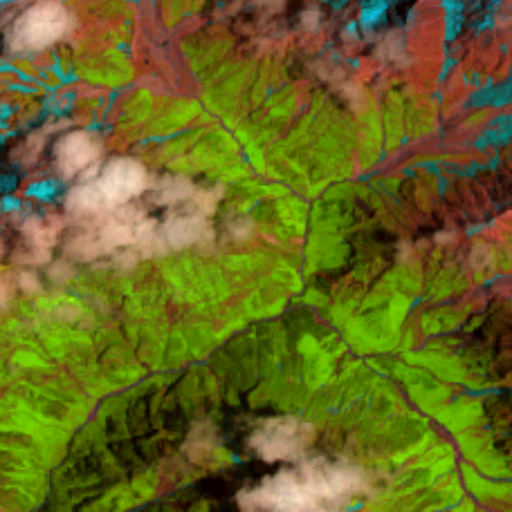</td>
<td>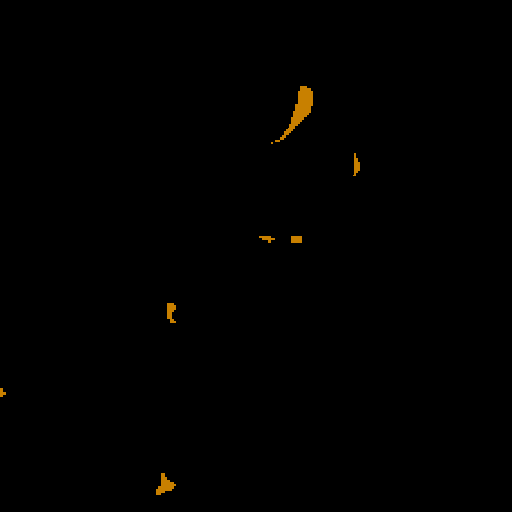</td>
<td>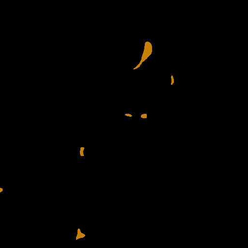</td>
</tr>
<tr>
<td>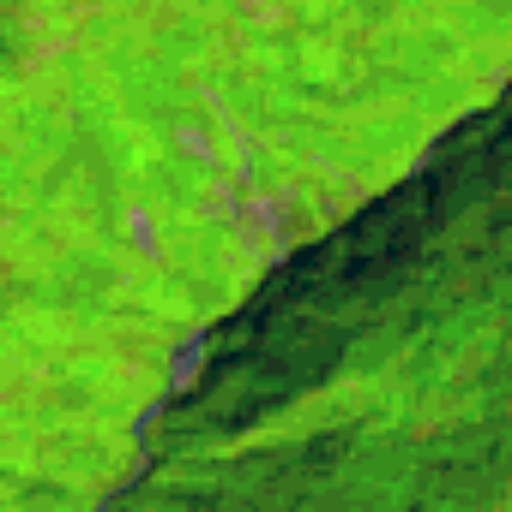</td>
<td>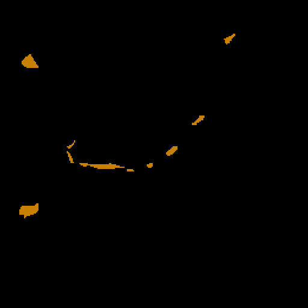</td>
<td>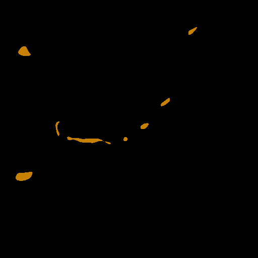</td>
</tr>
<tr>
<td>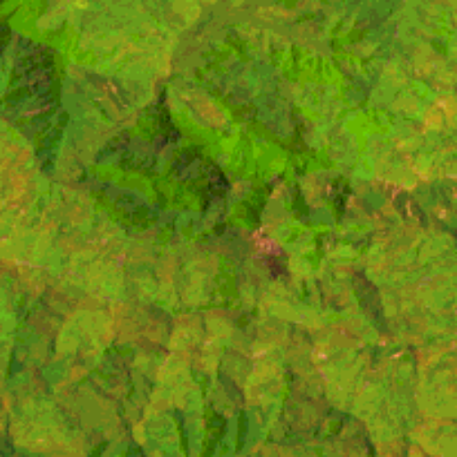</td>
<td></td>
<td></td>
</tr>
</table>

 
<h3>1  Dataset Citation</h3>
The dataset used here was derived from   
<a href="https://zenodo.org/records/3675407">
Nepal landslide dataset for semantic segmentation</a>
  
Bragagnolo, Lucimara; Rezende, Lujan Rafael; da Silva, Roberto Valmir; Grzybowski, José Mario Vicensi
  
This database contains images used for the semantic segmentation of landslide scars from a fully convolutional neural network U-Net.
 
<b>1. Training dataset:</b> it contains 230 GeoTIFF 8 bits images and associated PNG masks (scars indicated in white and background in black color).
 
<b>2. Validation dataset: </b>it contains 35 GeoTIFF 8 bits images and associated PNG masks used for U-Net validation step.
 
<b>3. Test dataset: </b>it contains 10 GeoTIFF 8 bits images and associated PNG masks for testing.
  
<b>Citation</b> 
Bragagnolo, L., Rezende, L. R., da Silva, R. V., & Grzybowski, J. M. V. (2020).  
Nepal landslide dataset for semantic segmentation (Version 1) [Data set]. Zenodo.
<a href=" https://doi.org/10.5281/zenodo.3675407"> https://doi.org/10.5281/zenodo.3675407</a>
  
<b>License</b> 
<a href="https://creativecommons.org/licenses/by/4.0/legalcode">Creative Commons Attribution 4.0 International</a>
  
<h3>
2 Nepal-LandSlide ImageMask Dataset
</h3>
 If you would like to train this Nepal-LandSlide Segmentation model by yourself,
please download the master  dataset from
<a href="https://drive.google.com/file/d/1rFFfTHUbh_D5BG8dv2r_eBbeRSNiirqx/view?usp=sharing"><b>Augmented-Nepal-LandSlide-ImageMaskDataset.zip</b> </a>
, expand the downloaded, and put it under <b>./dataset</b> folder to be:
<pre>
./dataset
└─Nepal-LandSlide
    ├─test
    │   ├─images
    │   └─masks
    ├─train
    │   ├─images
    │   └─masks
    └─valid
         ├─images
         └─masks
</pre>
 
As shown below, the number of images of train and valid datasets is large enough to use for a training set of our segmentation model.
<b>Nepal-LandSlide Statistics</b> 
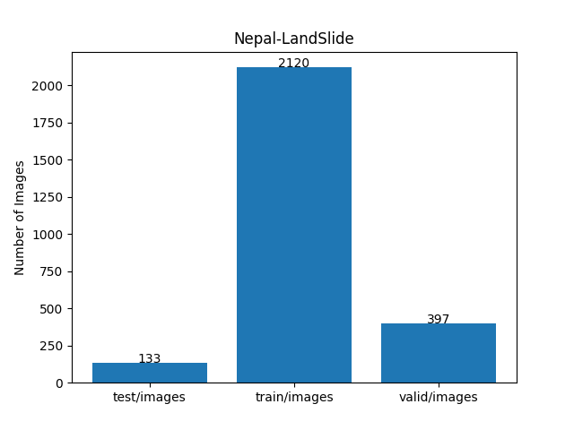 
 
  
<b>Train_images_sample</b> 
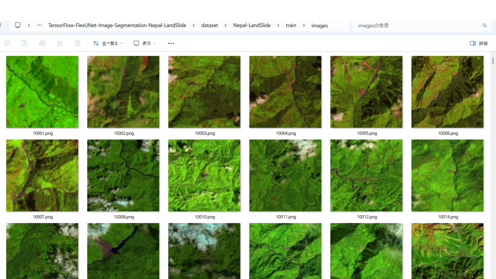
 
<b>Train_masks_sample</b> 
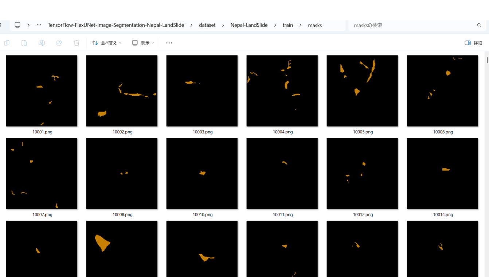
 
<h3>
3 Train TensorflowFlexUNet Model
</h3>
 We trained Nepal-LandSlide TensorflowFlexUNet Model by using the following
<a href="./projects/TensorFlowFlexUNet/Nepal-LandSlide/train_eval_infer.config"> <b>train_eval_infer.config</b></a> file.  
Please move to ./projects/TensorFlowFlexUNet/Nepal-LandSlide and run the following bat file. 
<pre>
>1.train.bat
</pre>
, which simply runs the following command. 
<pre>
>python ../../../src/TensorFlowFlexUNetTrainer.py ./train_eval_infer.config
</pre>

<b>Model parameters</b> 
Defined a small <b>base_filters=16</b> and a large <b>base_kernels=(11,11)</b> for the first Conv Layer of Encoder Block of 
<a href="./src/TensorFlowFlexUNet.py">TensorFlowFlexUNet.py</a> 
and a large num_layers (including a bridge between Encoder and Decoder Blocks).
<pre>
[model]
image_width    = 512
image_height   = 512
image_channels = 3
input_normalize = True
normalization  = False
num_classes    = 2
base_filters   = 16
base_kernels  = (11,11)
num_layers    = 8
dropout_rate   = 0.05
dilation       = (1,1)
</pre>
<b>Learning rate</b> 
Defined a small learning rate.  
<pre>
[model]
learning_rate  = 0.00006
</pre>
<b>Loss and metrics functions</b> 
Specified "categorical_crossentropy" and "dice_coef_multiclass". 
<pre>
[model]
loss           = "categorical_crossentropy"
metrics        = ["dice_coef_multiclass"]
</pre>
<b >Learning rate reducer callback</b> 
Enabled learing_rate_reducer callback, and a small reducer_patience.
<pre> 
[train]
learning_rate_reducer = True
reducer_factor     = 0.5
reducer_patience   = 4
</pre>
<b>Early stopping callback</b> 
Enabled early stopping callback with patience parameter.
<pre>
[train]
patience      = 10
</pre>
<b></b> 
<b>RGB color map</b> 
rgb color map dict for Nepal-LandSlide 1+1 classes. 
<pre>
[mask]
mask_file_format = ".png"
;Nepal-LandSlide 1+1
;                  LandSlide: 
rgb_map = {(0,0,0):0, (200, 128, 0):1,}
</pre>
<b>Epoch change inference callbacks</b> 
Enabled epoch_change_infer callback. 
<pre>
[train]
epoch_change_infer       = True
epoch_change_infer_dir   =  "./epoch_change_infer"
epoch_changeinfer        = False
epoch_changeinfer_dir    = "./epoch_changeinfer"
num_infer_images         = 6
</pre>
By using this epoch_change_infer callback, on every epoch_change, the inference procedure can be called
 for 6 images in <b>mini_test</b> folder. This will help you confirm how the predicted mask changes 
 at each epoch during your training process.    
<b>Epoch_change_inference output at starting (1,2,3)</b> 
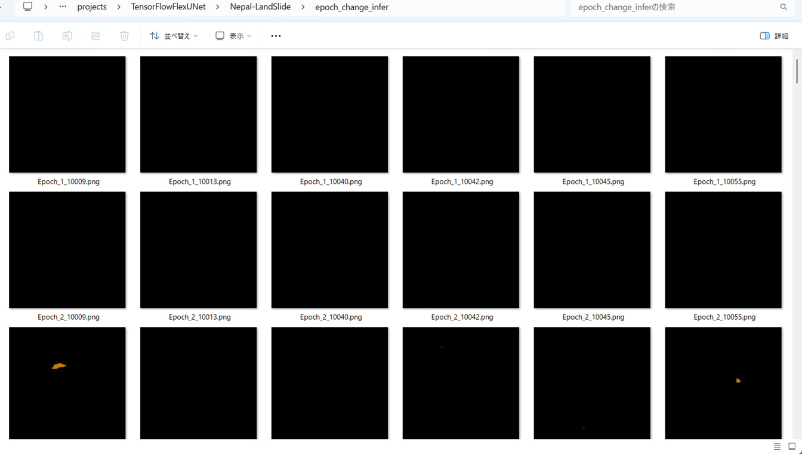 
 
<b>Epoch_change_inference output at ending (34,35,36)</b> 
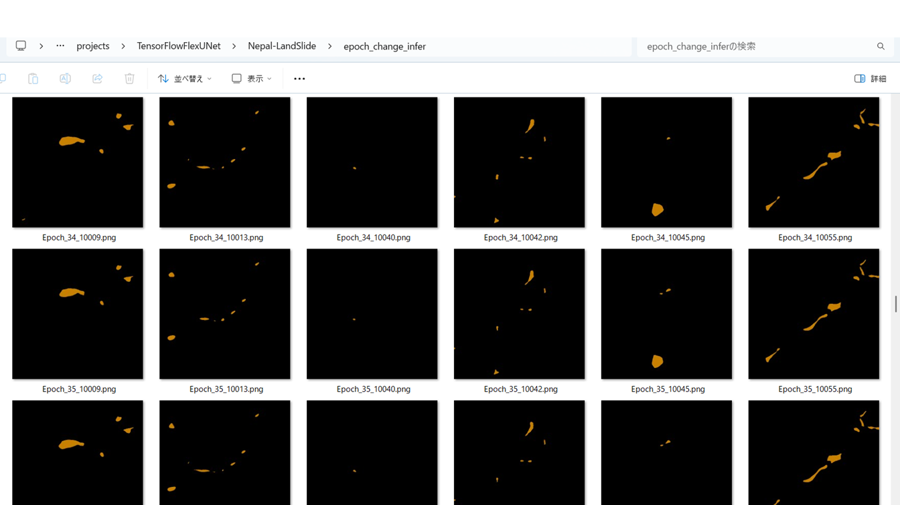 
 
<b>Epoch_change_inference output at ending (69,70,71)</b> 
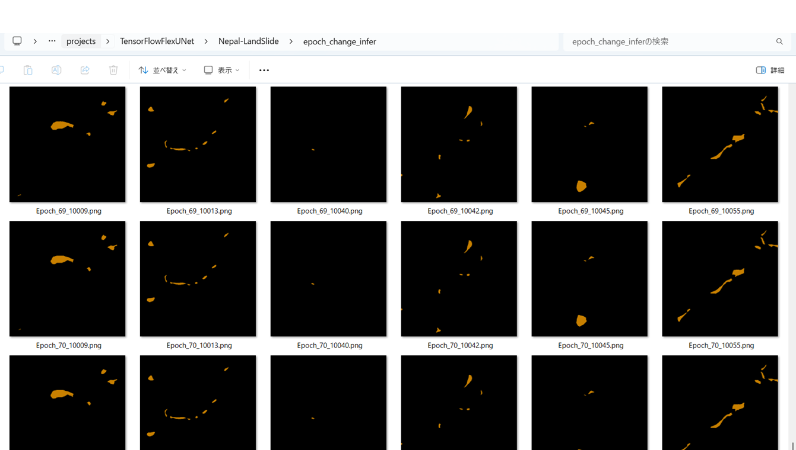 

 
In this experiment, the training process was stopped at epoch 71 by EarlyStoppingCallback.  
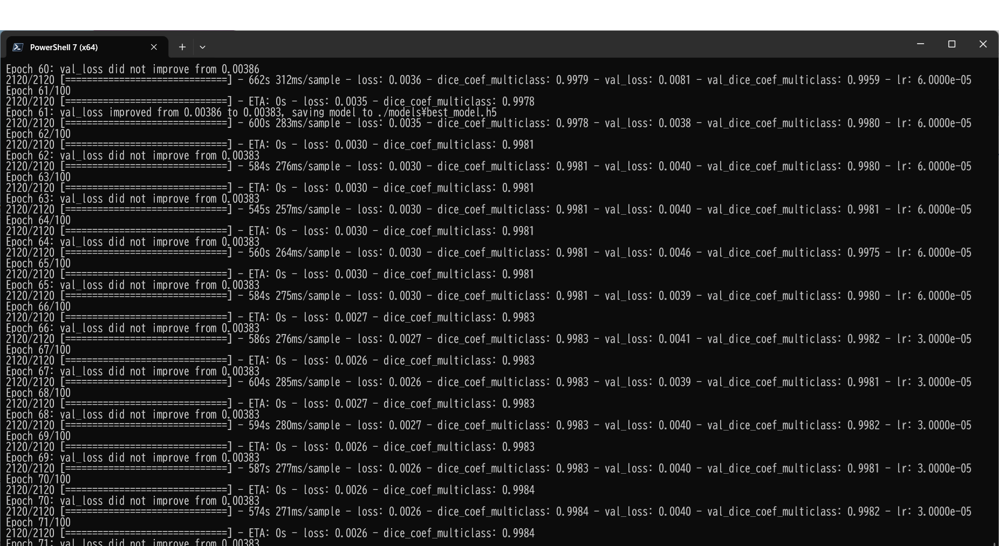 
 
<a href="./projects/TensorFlowFlexUNet/Nepal-LandSlide/eval/train_metrics.csv">train_metrics.csv</a> 
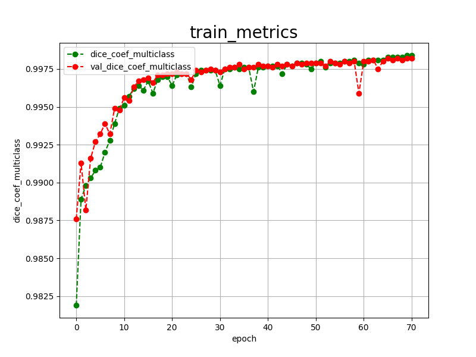 

 
<a href="./projects/TensorFlowFlexUNet/Nepal-LandSlide/eval/train_losses.csv">train_losses.csv</a> 
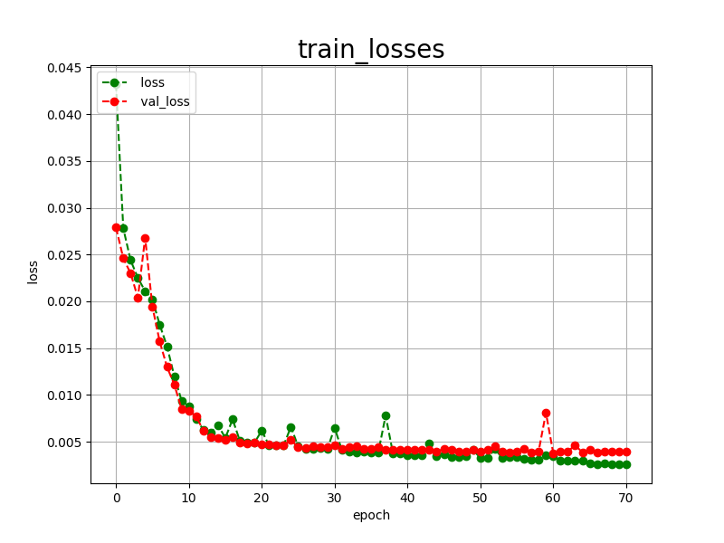 
 
<h3>
4 Evaluation
</h3>
Please move to a <b>./projects/TensorFlowFlexUNet/Nepal-LandSlide</b> folder, 
and run the following bat file to evaluate TensorFlowFlexUNet model for Nepal-LandSlide. 
<pre>
>./2.evaluate.bat
</pre>
This bat file simply runs the following command.
<pre>
>python ../../../src/TensorFlowFlexUNetEvaluator.py  ./train_eval_infer.config
</pre>
Evaluation console output: 
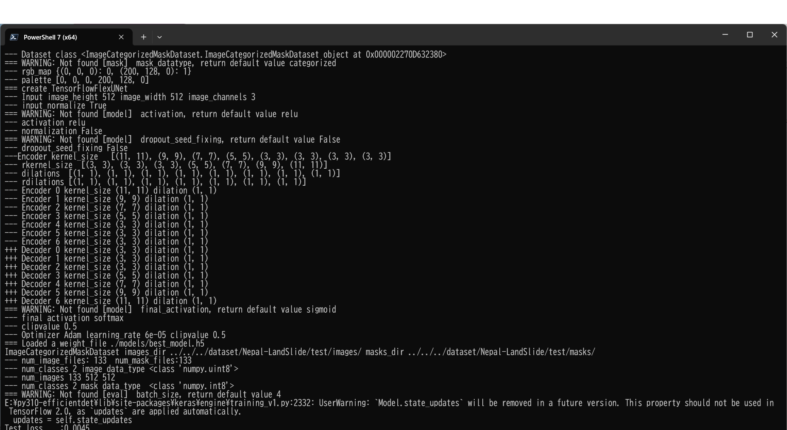
  Image-Segmentation-Nepal-LandSlide
<a href="./projects/TensorFlowFlexUNet/Nepal-LandSlide/evaluation.csv">evaluation.csv</a> 
The loss (categorical_crossentropy) to this Nepal-LandSlide/test was very low, and dice_coef_multiclass very high as shown below.
 
<pre>
categorical_crossentropy,0.0045
dice_coef_multiclass,0.9977
</pre>
 
<h3>5 Inference</h3>
Please move to a <b>./projects/TensorFlowFlexUNet/Nepal-LandSlide</b> folder 
,and run the following bat file to infer segmentation regions for images by the Trained-TensorflowFlexUNet model for Nepal-LandSlide. 
<pre>
>./3.infer.bat
</pre>
This simply runs the following command.
<pre>
>python ../../../src/TensorFlowFlexUNetInferencer.py ./train_eval_infer.config
</pre>

<b>mini_test_images</b> 
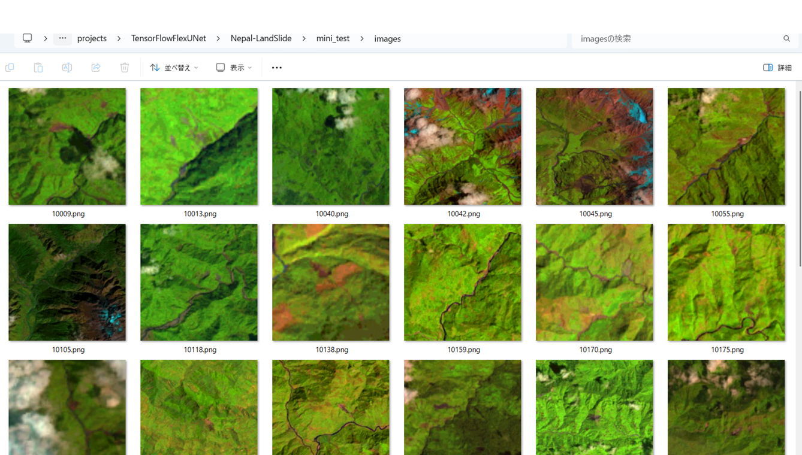 
<b>mini_test_mask(ground_truth)</b> 
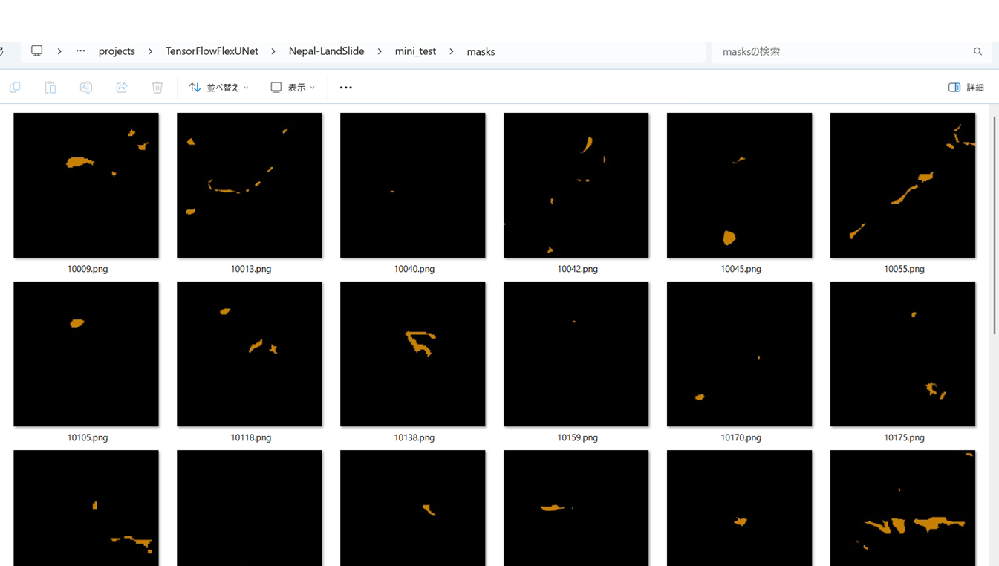 

<b>Inferred test masks</b> 
 
 

<b>Enlarged images and masks for  Nepal-LandSlide Images of 512x512 pixels</b> 
As shown below, the inferred masks predicted by our segmentation model trained by the dataset appear similar to the ground truth masks.
 
 
<table>
<tr>
<th>Input: image</th>
<th>Mask (ground_truth)</th>
<th>Prediction: inferred_mask</th>
</tr>
<tr>
<td></td>
<td></td>
<td></td>
</tr>

<tr>
<td>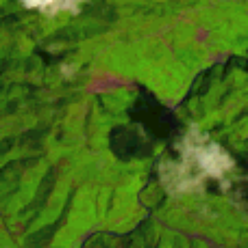</td>
<td></td>
<td>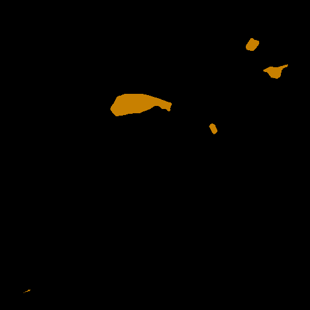</td>
</tr>

<tr>
<td>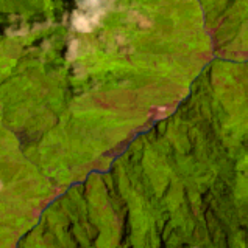</td>
<td>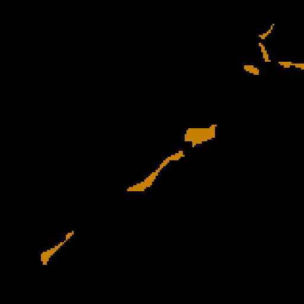</td>
<td></td>
</tr>
<tr>
<td>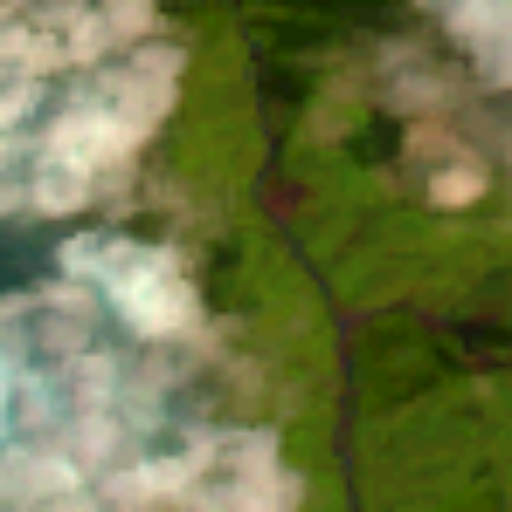</td>
<td></td>
<td>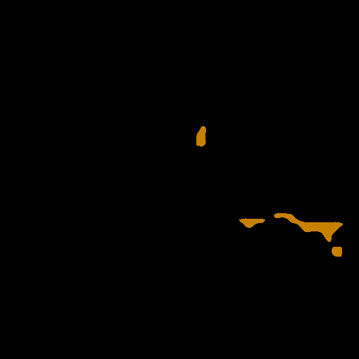</td>
</tr>
<tr>
<td>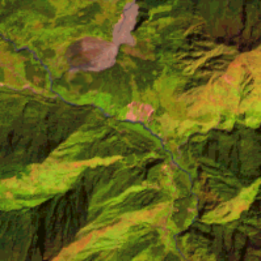</td>
<td>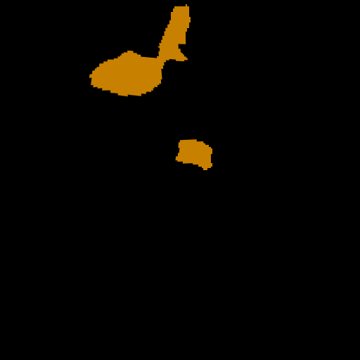</td>
<td></td>
</tr>
<tr>
<td>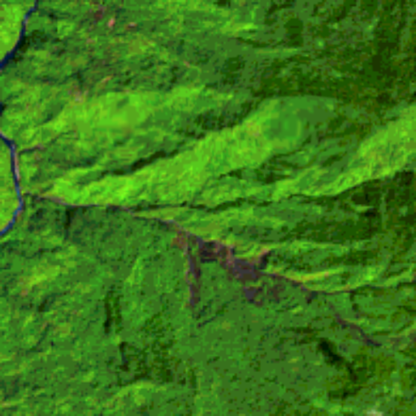</td>
<td>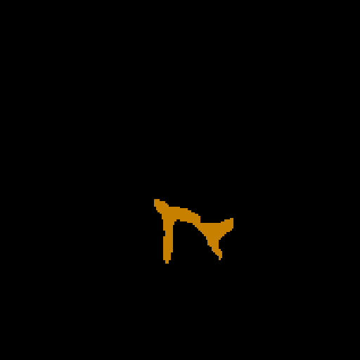</td>
<td></td>
</tr>
</table>

 
<h3>
References
</h3>
<b>1. TensorFlow-FlexUNet-Image-Segmentation-Landslide4Sense</b> 
Toshiyuki Arai  
<a href="https://github.com/atlan-antillia/TensorFlow-FlexUNet-Image-Segmentation-Landslide4Sense">
https://github.com/atlan-antillia/TensorFlow-FlexUNet-Image-Segmentation-Landslide4Sense
</a>
 
 
<b>2. TensorFlow-FlexUNet-Image-Segmentation-Hokkaido-Iburi-Tobu-Landslide</b> 
Toshiyuki Arai  
<a href="https://github.com/atlan-antillia/TensorFlow-FlexUNet-Image-Segmentation-Hokkaido-Iburi-Tobu-Landslide">
https://github.com/atlan-antillia/TensorFlow-FlexUNet-Image-Segmentation-Hokkaido-Iburi-Tobu-Landslide
</a>
 
 
<b>3. TensorFlow-FlexUNet-Tiled-Image-Segmentation-Sichuan-Landslide</b> 
Toshiyuki Arai  
<a href="https://github.com/atlan-antillia/TensorFlow-FlexUNet-Tiled-Image-Segmentation-Sichuan-Landslide">
https://github.com/atlan-antillia/TensorFlow-FlexUNet-Tiled-Image-Segmentation-Sichuan-Landslide
</a>
 
 
<b>4. TensorFlow-FlexUNet-Image-Segmentation-Japan-Landslide</b> 
Toshiyuki Arai  
<a href="https://github.com/atlan-antillia/TensorFlow-FlexUNet-Image-Segmentation-Japan-Landslide">
https://github.com/atlan-antillia/TensorFlow-FlexUNet-Image-Segmentation-Japan-Landslide
</a>
 
 
<b>5. TensorFlow-FlexUNet-Image-Segmentation-Model</b> 
Toshiyuki Arai  
<a href="https://github.com/sarah-antillia/TensorFlow-FlexUNet-Image-Segmentation-Model">
https://github.com/sarah-antillia/TensorFlow-FlexUNet-Image-Segmentation-Model
</a>
 
 
